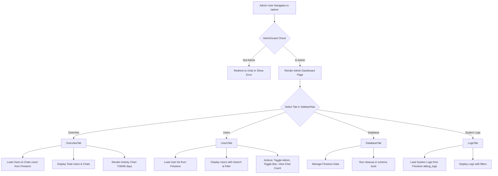

```mermaid
flowchart TD
    A[Admin User Navigates to /admin] --> B{AdminGuard Check}
    B -- Not Admin --> C[Redirect to /chat or Show Error]
    B -- Is Admin --> D[Render Admin Dashboard Page]

    D --> E{Select Tab in Sidebar/Nav}

    E -->|Overview| F[OverviewTab]
    F --> F1[Load Users & Chats count from Firestore]
    F --> F2[Display Total Users & Chats]
    F --> F3[Render Activity Chart 7/30/90 days]

    E -->|Users| G[UsersTab]
    G --> G1[Load User list from Firestore]
    G --> G2[Display Users with Search & Filter]
    G --> G3[Actions: Toggle Admin, Toggle Ban, View Chat Count]

    E -->|Database| H[DatabaseTab]
    H --> H1[Manage Firestore Data]
    H --> H2[Run cleanup or schema tools]

    E -->|System Logs| I[LogsTab]
    I --> I1[Load System Logs from Firestore debug_logs]
    I --> I2[Display Logs with filters]
```
