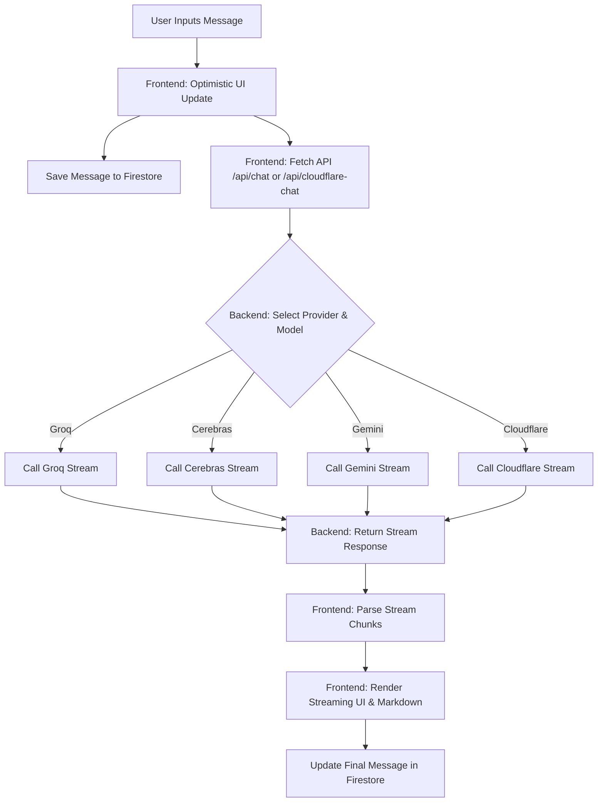

```mermaid
flowchart TD
    A[User Inputs Message] --> B[Frontend: Optimistic UI Update]
    B --> C[Save Message to Firestore]
    B --> D[Frontend: Fetch API /api/chat or /api/cloudflare-chat]
    D --> E{Backend: Select Provider & Model}
    E -->|Groq| F[Call Groq Stream]
    E -->|Cerebras| G[Call Cerebras Stream]
    E -->|Gemini| H[Call Gemini Stream]
    E -->|Cloudflare| I[Call Cloudflare Stream]
    F & G & H & I --> J[Backend: Return Stream Response]
    J --> K[Frontend: Parse Stream Chunks]
    K --> L[Frontend: Render Streaming UI & Markdown]
    L --> M[Update Final Message in Firestore]
```
