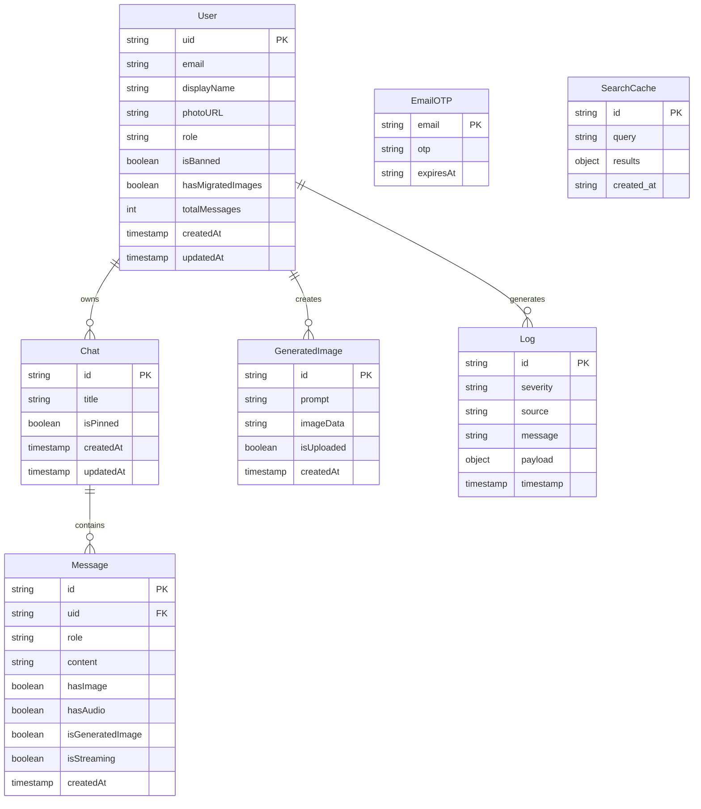
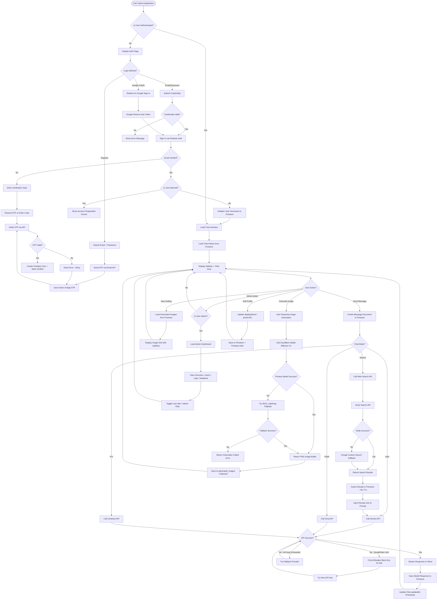

# Chris AI (Chrono) - Thesis Documentation

## 1. ENTITY RELATIONSHIP DIAGRAM

---

## 2. CONTEXT DIAGRAM

```mermaid
flowchart TB
    subgraph Actors [External Actors]
        direction LR
        User([End User])
        Admin([Administrator])
    end

    subgraph ChronoSystem [Chrono AI System]
        direction TB
        subgraph CoreModules [Core Modules]
            direction LR
            AuthModule[Authentication]
            ChatModule[Chat Engine]
            ImageModule[Image Generation]
            SearchModule[Web Search]
            AdminModule[Admin Dashboard]
            ProfileModule[Profile Mgmt]
        end
        subgraph InfraModules [Infrastructure]
            direction LR
            APIFallback[API Fallback / Circuit Breaker]
        end
    end

    subgraph AuthProviders [Authentication Providers]
        direction LR
        GoogleAuth([Google OAuth])
        FirebaseAuth([Firebase Auth])
    end

    subgraph AIProviders [AI Model Providers]
        direction LR
        GeminiAPI([Gemini API])
        GroqAPI([Groq API])
        CerebrasAPI([Cerebras API])
        CloudflareAPI([Cloudflare Workers AI])
    end

    subgraph SearchProviders [Search Providers]
        direction LR
        TavilyAPI([Tavily Search])
        GoogleCSE([Google Custom Search])
    end

    subgraph DataLayer [Data & Storage Layer]
        direction LR
        Firestore[(Cloud Firestore)]
        FirebaseStorage[(Firebase Storage)]
    end

    subgraph EmailService [Email Service]
        GmailSMTP([Gmail SMTP])
    end

    Actors -->|Login / Register / OTP| AuthModule
    Actors -->|Send Messages| ChatModule
    Actors -->|Generate Images| ImageModule
    Actors -->|Web Search| SearchModule
    Actors -->|Edit Profile| ProfileModule
    Admin -->|Manage Users / Logs| AdminModule

    AuthModule -->|OAuth Redirect| GoogleAuth
    AuthModule -->|Verify Identity| FirebaseAuth
    AuthModule -->|Send OTP / Reset Link| GmailSMTP
    AuthModule -->|Read/Write User Data| Firestore

    ChatModule -->|AI Requests| APIFallback
    APIFallback -->|Primary| GeminiAPI
    APIFallback -->|Fallback| GroqAPI
    APIFallback -->|Fallback| CerebrasAPI
    APIFallback -->|Fallback| CloudflareAPI
    ChatModule -->|Persist Messages| Firestore
    ChatModule -->|Trigger Search| SearchModule

    ImageModule -->|Generate Images| CloudflareAPI
    ImageModule -->|Store Images| Firestore

    SearchModule -->|Primary| TavilyAPI
    SearchModule -->|Fallback| GoogleCSE
    SearchModule -->|Cache Results| Firestore

    AdminModule -->|Read Users / Logs| Firestore
    AdminModule -->|Update Role / Ban| Firestore

    ProfileModule -->|Update Data| Firestore
    ProfileModule -->|Upload Avatar| FirebaseStorage

    FirebaseAuth -->|Auth State| AuthModule
    Firestore -->|Real-time Updates| ChatModule
    Firestore -->|Real-time Updates| AdminModule
```

---

## 3. SYSTEM FLOWCHART

---

## 4. DATABASE DESIGN

### 4.1 Users Collection

**Collection Path:** `users/{userId}`

| Column Name | Data Type | Constraints | Description |
|---|---|---|---|
| uid | string | Required, Immutable | Firebase Auth UID (matches document ID) |
| email | string | Required, Immutable, Valid Email Format | User email address |
| displayName | string | Optional, Max 100 chars | User display name |
| photoURL | string | Optional, Max 1MB | Profile photo URL or base64 data |
| role | string | Optional, Max 20 chars | User role: "admin" or "user" |
| isBanned | boolean | Optional, Default false | Account suspension flag |
| hasMigratedImages | boolean | Optional, Default false | Image migration completion flag |
| hasMigratedImagesV2 | boolean | Optional | Second migration flag |
| totalMessages | integer | Optional | Total message count |
| createdAt | timestamp | Required, Immutable | Account creation timestamp |
| updatedAt | timestamp | Optional | Last profile update timestamp |

### 4.2 Chats Subcollection

**Collection Path:** `users/{userId}/chats/{chatId}`

| Column Name | Data Type | Constraints | Description |
|---|---|---|---|
| id | string | Required, Immutable | Chat session ID |
| title | string | Required, Max 256 chars | Chat title |
| isPinned | boolean | Optional | Pin status for sidebar ordering |
| createdAt | timestamp | Required, Immutable | Chat creation timestamp |
| updatedAt | timestamp | Required | Last message timestamp (for sorting) |

### 4.3 Messages Subcollection

**Collection Path:** `users/{userId}/chats/{chatId}/messages/{messageId}`

| Column Name | Data Type | Constraints | Description |
|---|---|---|---|
| id | string | Required, Immutable | Message ID |
| uid | string | Optional, Max 128 chars | Owner user ID |
| role | string | Required, Enum: "user" or "model" | Sender role |
| content | string | Required, Max 1MB | Message text content |
| hasImage | boolean | Optional | Image attachment flag |
| hasAudio | boolean | Optional | Audio attachment flag |
| isGeneratedImage | boolean | Optional | AI-generated image flag |
| isStreaming | boolean | Optional | Active streaming flag |
| imageUrl | string | Optional | Uploaded image URL |
| feedback | string | Optional | User feedback: "upvote" or "downvote" |
| createdAt | timestamp | Required, Immutable | Message creation timestamp |

### 4.4 Generated Images Subcollection

**Collection Path:** `users/{userId}/generated_images/{imageId}`

| Column Name | Data Type | Constraints | Description |
|---|---|---|---|
| prompt | string | Required, Max 1MB | Image generation prompt |
| imageData | string | Required, Max 1MB | Base64 encoded image data |
| isUploaded | boolean | Optional | Distinguishes uploaded vs. generated |
| createdAt | timestamp | Required, Immutable | Image creation timestamp |

### 4.5 Logs Collection

**Collection Path:** `logs/{logId}`

| Column Name | Data Type | Constraints | Description |
|---|---|---|---|
| severity | string | Required | Log level: "info", "warning", "error" |
| source | string | Required | Component that generated the log |
| message | string | Required | Log message text |
| payload | object | Optional | Additional structured data |
| timestamp | timestamp | Required | Log creation timestamp |

### 4.6 Email OTPs Collection

**Collection Path:** `email_otps/{email}`

| Column Name | Data Type | Constraints | Description |
|---|---|---|---|
| otp | string | Required | 6-digit verification code |
| expiresAt | string (ISO 8601) | Required | Expiration time (10 minutes from creation) |

### 4.7 Search Cache Collection

**Collection Path:** `search_cache/{docId}`

| Column Name | Data Type | Constraints | Description |
|---|---|---|---|
| query | string | Required | Normalized search query (lowercase) |
| results | object | Required | JSON array of search results |
| created_at | string (ISO 8601) | Required | Cache entry timestamp (72-hour TTL) |

### 4.8 Entity Relationships Summary

| Relationship | Type | Description |
|---|---|---|
| User -> Chat | One-to-Many | Each user owns multiple chat sessions |
| Chat -> Message | One-to-Many | Each chat contains multiple messages |
| User -> GeneratedImage | One-to-Many | Each user has multiple generated images |
| User -> Log | One-to-Many | System logs are associated with user actions |

---

## 5. SYSTEM REQUIREMENTS

### 5.1 Software & Frameworks

| Category | Technology | Version | Purpose |
|---|---|---|---|
| Runtime | Node.js | 18+ | Server-side JavaScript runtime |
| Framework | Next.js | 16.2.1 | React-based full-stack web framework |
| UI Library | React | 19.0.0 | Component-based UI library |
| Language | TypeScript | 5.8.2 | Type-safe JavaScript superset |
| Styling | Tailwind CSS | 4.1.14 | Utility-first CSS framework |
| CSS Plugin | @tailwindcss/typography | 0.5.19 | Prose styling for markdown content |
| Animation | Motion (Framer Motion) | 12.23.24 | UI animation library |
| Icons | Lucide React | 0.546.0 | SVG icon library |
| Charts | Recharts | 3.8.1 | Data visualization for admin dashboard |
| Toasts | Sonner | 2.0.7 | Toast notification system |
| Theme | next-themes | 0.4.6 | Dark/light mode management |
| Markdown | react-markdown | 10.1.0 | Markdown rendering |
| Markdown Plugins | remark-gfm | 4.0.1 | GitHub Flavored Markdown support |
| Markdown Plugins | remark-math | 6.0.0 | LaTeX math expression parsing |
| Markdown Plugins | rehype-katex | 7.0.1 | KaTeX math rendering |
| Math | KaTeX | 0.16.44 | LaTeX math typesetting |
| Code Highlighting | react-syntax-highlighter | 16.1.1 | Syntax highlighting for code blocks |
| Styled Components | styled-components | 6.4.0 | CSS-in-JS for syntax highlighter |
| Loaders | ldrs | 1.1.9 | Loading spinner components |
| Date Utilities | date-fns | 4.1.0 | Date formatting and manipulation |
| Env Config | dotenv | 17.2.3 | Environment variable loading |

### 5.2 Backend & Cloud Services

| Category | Technology | Version | Purpose |
|---|---|---|---|
| Authentication | Firebase Authentication | 12.11.0 | User auth (email/password + Google OAuth) |
| Admin SDK | Firebase Admin SDK | 13.8.0 | Server-side auth & user management |
| Database | Cloud Firestore | (via Firebase SDK) | NoSQL document database |
| Storage | Firebase Storage | (via Firebase SDK) | User avatar / file storage |
| Email | Nodemailer | 8.0.7 | OTP & password reset email delivery |

### 5.3 AI & Search API Providers

| Provider | SDK/Library | Purpose |
|---|---|---|
| Google Gemini | @google/genai 1.29.0 | Primary AI chat model |
| Groq | REST API (via proxy) | Fallback AI chat model |
| Cerebras | REST API (via proxy) | Fallback AI chat model |
| Cloudflare Workers AI | REST API (via proxy) | Fallback AI chat + Image generation |
| Tavily | @tavily/core 0.7.2 | Primary web search |
| Google Custom Search | REST API | Fallback web search |

### 5.4 Environment Variables

| Variable | Required | Description |
|---|---|---|
| NEXT_PUBLIC_GEMINI_API_KEY | Yes | Primary Gemini API key |
| NEXT_PUBLIC_GEMINI_API_KEY_SECONDARY | No | Secondary Gemini key (fallback) |
| NEXT_PUBLIC_GEMINI_API_KEY_TERTIARY | No | Tertiary Gemini key (fallback) |
| NEXT_PUBLIC_GROQ_API_KEY | No | Primary Groq API key |
| NEXT_PUBLIC_GROQ_API_KEY_SECONDARY | No | Secondary Groq key |
| NEXT_PUBLIC_GROQ_API_KEY_TERTIARY | No | Tertiary Groq key |
| NEXT_PUBLIC_CEREBRAS_API_KEY | No | Primary Cerebras API key |
| NEXT_PUBLIC_CEREBRAS_API_KEY_SECONDARY | No | Secondary Cerebras key |
| NEXT_PUBLIC_CEREBRAS_API_KEY_TERTIARY | No | Tertiary Cerebras key |
| CLOUDFLARE_ACCOUNT_ID | No | Cloudflare account for Workers AI |
| CLOUDFLARE_API_TOKEN | No | Cloudflare API token |
| TAVILY_API_KEY | No | Tavily search API key |
| GOOGLE_API_KEY | No | Google Custom Search API key |
| GOOGLE_CX | No | Google Custom Search Engine ID |
| NEXT_PUBLIC_FIREBASE_API_KEY | Yes | Firebase project API key |
| NEXT_PUBLIC_FIREBASE_AUTH_DOMAIN | Yes | Firebase auth domain |
| NEXT_PUBLIC_FIREBASE_PROJECT_ID | Yes | Firebase project ID |
| NEXT_PUBLIC_FIREBASE_STORAGE_BUCKET | Yes | Firebase storage bucket |
| NEXT_PUBLIC_FIREBASE_MESSAGING_SENDER_ID | Yes | Firebase messaging sender ID |
| NEXT_PUBLIC_FIREBASE_APP_ID | Yes | Firebase app ID |
| NEXT_PUBLIC_FIREBASE_FIRESTORE_DATABASE_ID | No | Firestore database ID |
| FIREBASE_PROJECT_ID | Yes (server) | Firebase Admin SDK project ID |
| FIREBASE_CLIENT_EMAIL | Yes (server) | Firebase Admin SDK client email |
| FIREBASE_PRIVATE_KEY | Yes (server) | Firebase Admin SDK private key |
| EMAIL_USER | Yes (server) | Gmail account for sending emails |
| EMAIL_PASSWORD | Yes (server) | Gmail app password for SMTP |
| APP_URL | No | Application deployment URL |

### 5.5 Development & Build Tools

| Tool | Version | Purpose |
|---|---|---|
| Vite (via Next.js) | 5.4.2 (underlying) | Build toolchain |
| ESLint | 9.9.1 | Code linting |
| PostCSS | 8.4.35 | CSS processing |
| Autoprefixer | 10.4.18 | CSS vendor prefixing |
| Playwright | 1.59.1 | End-to-end testing |
| GitHub Actions | N/A | CI/CD auto-merge for Jules bot PRs |

### 5.6 Deployment

| Requirement | Detail |
|---|---|
| Hosting Platform | Vercel (inferred from auth domain: chronoaiassistant.vercel.app) |
| Node.js Version | 18+ |
| Package Manager | npm or pnpm (both lock files present) |
| Build Command | `next build` |
| Start Command | `next start --port=3000 --hostname=0.0.0.0` |

---

## 6. RECOMMENDATIONS

### 6.1 Security Improvements

1. **Remove Hardcoded API Keys from Source Code:** The `.env.example` file and multiple source files (e.g., `ChatArea.tsx`, `cloudflare-chat/route.ts`, `webSearch.ts`) contain hardcoded API keys as fallback defaults. These should be removed entirely. If environment variables are missing, the system should fail gracefully rather than expose credentials in client-side bundles.

2. **Move API Keys Server-Side:** Currently, Gemini, Groq, and Cerebras API keys are prefixed with `NEXT_PUBLIC_`, which exposes them in the client bundle. All AI provider API calls should be proxied through Next.js API routes (like the existing `/api/chat` and `/api/cloudflare-chat` routes) so keys remain server-side only.

3. **Implement Rate Limiting:** The application has no server-side rate limiting on API endpoints. Adding rate limiting middleware (e.g., using Upstash Ratelimit or a custom Redis-based solution) would prevent abuse of the chat, image generation, and search endpoints.

4. **Add CSRF Protection:** The API routes lack CSRF protection. While Next.js API routes with JSON bodies have some inherent protection, adding explicit CSRF tokens for state-changing operations (password reset, OTP verification) would strengthen security.

5. **Sanitize User Input Before Firestore Writes:** Although Firestore rules validate field types and sizes, the application should sanitize user input on the server side to prevent potential injection attacks, especially for the chat message content and image prompt fields.

6. **Secure OTP Storage:** The `email_otps` collection stores OTPs in plaintext. Consider hashing OTPs with bcrypt before storage and comparing hashes during verification to prevent OTP theft if Firestore access is compromised.

7. **Remove Admin Email Hardcoding:** The admin check in `AuthContext.tsx` and `firestore.rules` hardcodes a specific Gmail address as the default admin. This should be replaced with a Firestore-based admin role system or Firebase Custom Claims.

### 6.2 Code Optimization

1. **Reduce ChatArea.tsx Complexity:** The `ChatArea.tsx` component exceeds 1,000 lines and handles message rendering, API calls, streaming, image generation, audio playback, search, and UI state. This should be decomposed into smaller, focused components and custom hooks (e.g., `useChatMessages`, `useStreaming`, `useImageGeneration`, `useAudioPlayback`).

2. **Implement Server-Side Caching for AI Responses:** Frequently asked questions or similar prompts produce redundant API calls. Implementing a response cache (using Firestore or Redis) with semantic similarity matching would reduce API costs and improve response times.

3. **Optimize Firestore Reads:** The admin dashboard's `OverviewTab` fetches all users and then iterates to fetch each user's chats individually, resulting in N+1 query patterns. Use Firestore aggregation queries or a denormalized counter field to reduce read operations.

4. **Add Pagination to Chat History:** The sidebar loads all chats via `onSnapshot` without pagination. For users with hundreds of chats, this creates unnecessary read costs and slower initial loads. Implement cursor-based pagination with lazy loading.

5. **Compress Image Storage:** Generated images are stored as base64 strings directly in Firestore, which has a 1MB document limit. Large images should be stored in Firebase Storage with Firestore holding only the reference URL, reducing database costs and improving load times.

6. **Implement Message Batching:** When streaming completes, each message is saved individually. For bulk operations (e.g., chat deletion with all messages), use Firestore batch writes to reduce write operations and ensure atomicity.

### 6.3 Feature Scaling

1. **Add Real-Time Collaboration:** Implement shared chat sessions where multiple users can participate in the same conversation, leveraging Firestore's real-time sync capabilities.

2. **Implement Conversation Branching:** Allow users to fork a conversation from any message point, creating alternative conversation paths without losing the original context.

3. **Add Model Fine-Tuning Integration:** Integrate with Google's model tuning API to allow users or admins to create custom-tuned models based on domain-specific data.

4. **Implement WebSocket-Based Streaming:** Replace Server-Sent Events with WebSocket connections for bidirectional communication, enabling features like real-time typing indicators and presence status.

5. **Add Export and Backup Features:** Allow users to export their chat history in standard formats (JSON, Markdown, PDF) and implement automated backup scheduling.

6. **Implement Analytics Dashboard:** Extend the admin dashboard with detailed analytics including per-user usage metrics, API cost tracking, model performance comparison, and anomaly detection for abuse prevention.

7. **Add Multi-Language Support:** Implement internationalization (i18n) using next-intl or react-i18next to support multiple languages for the UI, making the application accessible to a broader user base.

8. **Implement Progressive Web App (PWA) Features:** Add service worker support for offline caching of recent conversations, push notifications for new messages, and install-to-homescreen capability for mobile users.
