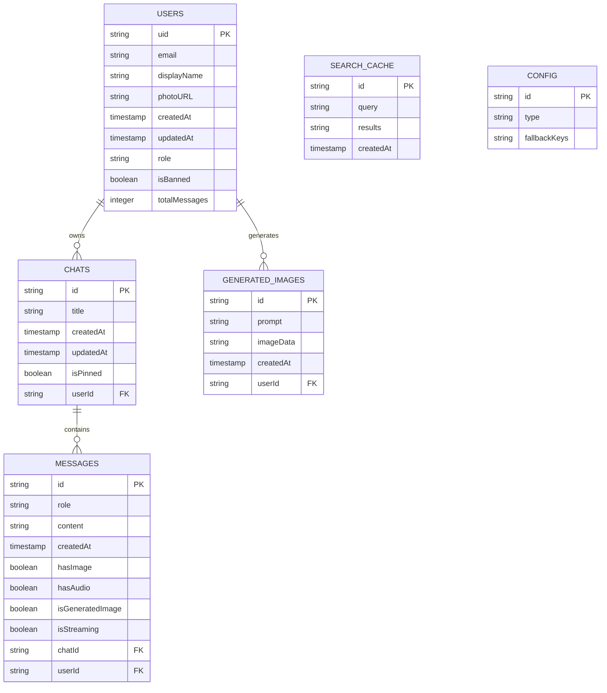
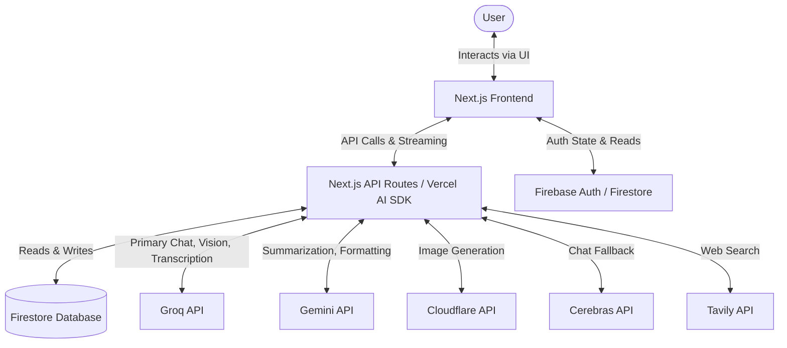
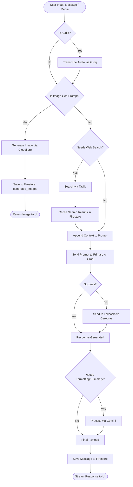

# Thesis Defense Documentation: System Architecture & Technical Specifications

## 1. ENTITY RELATIONSHIP DIAGRAM

The following Entity Relationship Diagram illustrates the database structure for the application, specifically modeling the Firestore schema defined in `firestore.rules`.

## 2. CONTEXT DIAGRAM

The Context Diagram outlines the high-level interactions between the User, the system's Next.js Frontend/Backend, and external APIs/Services.

## 3. SYSTEM FLOWCHART

This flowchart traces the core process logic of the application from user input to final output, including fallback mechanisms and external routing.

## 4. DATABASE DESIGN

The application utilizes Firebase Firestore, a NoSQL document database. Below is the schema based on security rules and system design:

### 1. `users` (Collection)
* **uid**: `string` (Primary Key, immutable)
* **email**: `string` (immutable)
* **displayName**: `string` (optional)
* **photoURL**: `string` (optional)
* **createdAt**: `timestamp` (immutable)
* **updatedAt**: `timestamp` (optional)
* **role**: `string` (optional, used for Admin access)
* **isBanned**: `boolean` (optional)
* **totalMessages**: `integer` (optional)
* **hasMigratedImages**: `boolean` (optional)

### 2. `chats` (Subcollection of `users/{userId}`)
* **id**: `string` (Primary Key)
* **title**: `string` (Required)
* **createdAt**: `timestamp` (immutable)
* **updatedAt**: `timestamp` (Required)
* **isPinned**: `boolean` (optional)
* **Foreign Key**: Derived from `userId` in document path.

### 3. `messages` (Subcollection of `users/{userId}/chats/{chatId}`)
* **id**: `string` (Primary Key)
* **role**: `string` (Enum: 'user', 'model')
* **content**: `string` (Required, limit 1MB)
* **createdAt**: `timestamp` (immutable)
* **uid**: `string` (Foreign Key to users)
* **hasImage**: `boolean` (optional)
* **hasAudio**: `boolean` (optional)
* **isGeneratedImage**: `boolean` (optional)
* **isStreaming**: `boolean` (optional)

### 4. `generated_images` (Subcollection of `users/{userId}`)
* **id**: `string` (Primary Key)
* **prompt**: `string` (Required)
* **imageData**: `string` (Required)
* **createdAt**: `timestamp` (immutable)

### 5. `config` (Collection)
* Documents like `system` and `models` store global configuration and API fallback keys.

### 6. `search_cache` (Collection)
* Used to temporarily cache Tavily web search results with a 72-hour TTL.

### 7. `logs` (Collection)
* Admin-only access, used for system activity logging.

## 5. SYSTEM REQUIREMENTS

The system relies on modern web technologies and a specific environment setup.

### **Technical Stack:**
* **Frontend Framework:** Next.js (v16.2.1), React (v19.0.0)
* **Language:** TypeScript
* **Styling:** Tailwind CSS (v4), styled-components
* **Animations:** Framer Motion (v12)
* **Icons:** Lucide-React & Custom SVGs
* **Markdown Parsing:** react-markdown, remark-gfm, remark-math, rehype-katex, katex
* **Backend Platform:** Firebase (v12.11.0) - Auth, Firestore, Security Rules
* **AI & Integration SDKs:**
  * Vercel AI SDK (`ai`, `@ai-sdk/react`, `@ai-sdk/google`, `@ai-sdk/openai`)
  * `@google/genai`
  * `@tavily/core`

### **Environment Configurations:**
* **Node.js:** Compatible with Next.js v16+
* **Package Manager:** `pnpm` (strictly enforced, npm/yarn not supported)
* **Environment Variables:** Requires a populated `.env` file without `NEXT_PUBLIC_` prefixes for secret keys. Expected keys include:
  * Groq API Key
  * Gemini API Key
  * Cloudflare API Key
  * Cerebras API Key
  * Tavily API Key
  * Firebase Configuration Variables

## 6. RECOMMENDATIONS

Based on the technical analysis of the application's current state, the following recommendations are provided for future scoping:

### **1. Code & Performance Optimization**
* **Unified AI SDK Usage:** While the system utilizes various SDKs (Groq, Gemini, Vercel AI), standardizing fully on the Vercel AI SDK's unified `generateText`/`streamText` interface could reduce bundle size and simplify the fallback logic (`apiFallback.ts`).
* **Pagination & Virtualization:** For users with extensive chat histories, implement cursor-based pagination for Firestore queries and virtualized lists (e.g., `react-window`) on the frontend to prevent DOM bloat and improve rendering performance.

### **2. Security Improvements**
* **Strict Rate Limiting:** Implement server-side rate limiting (e.g., using Redis or Upstash) for critical endpoints (`/api/chat`, `/api/generate-image`) to prevent API abuse and unexpected cost overruns from external providers.
* **Secret Management:** Transition environment variables from local `.env` files to a secure vault or secret management service (like AWS Secrets Manager or Vercel Secrets), especially for sensitive AI provider fallback keys currently stored in Firestore.

### **3. Future Feature Scaling**
* **Local LLM Integration:** Introduce support for local model inference (e.g., via Ollama or WebGPU) to reduce reliance on cloud providers for basic queries and improve privacy.
* **Retrieval-Augmented Generation (RAG):** Enhance the chatbot's capabilities by implementing a vector database (e.g., Pinecone or Firebase Vector Search) to allow users to upload and chat with their own large documents (PDFs, docs).
* **Admin Analytics Dashboard:** Build out the admin interface to include data visualization (utilizing the already installed `recharts` library) for monitoring API usage, active users, and error fallback rates.