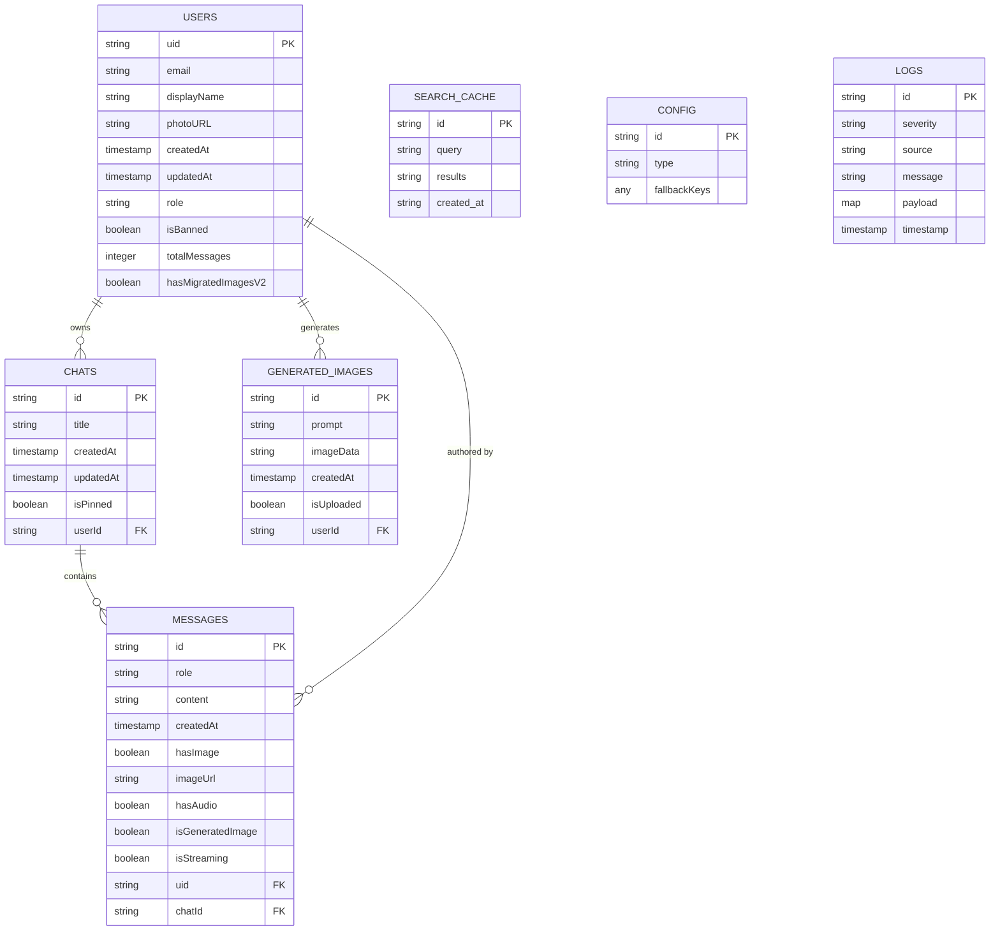
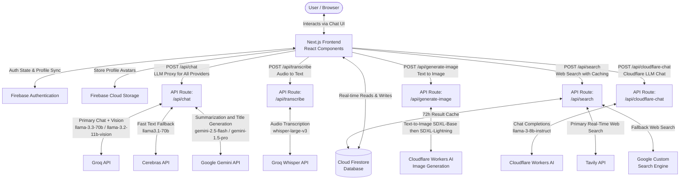

# Thesis Defense Documentation: System Architecture & Technical Specifications

## 1. ENTITY RELATIONSHIP DIAGRAM

The following Entity Relationship Diagram illustrates the complete database structure for the application, modeled from the Firestore schema defined in `firestore.rules`, `firebase-blueprint.json`, and runtime usage in `ChatArea.tsx` and `ImagineGallery.tsx`.



---

## 2. CONTEXT DIAGRAM

The Context Diagram outlines the high-level interactions between the User, the system's Next.js Frontend/Backend, and all external APIs and services. Data flows, integrations, and caching layers are represented.



---

## 3. SYSTEM FLOWCHART

This flowchart traces the core process logic of the application from initial page load through user input to final streamed output, including authentication, intent detection, fallback routing, and persistence.

```mermaid
flowchart TD
    A([User Opens App]) --> B{Is Authenticated?}
    B -- No --> C[Show AuthPage:\nEmail/Password or Google Sign-In]
    C --> D[Firebase Auth]
    D --> E{Auth Success?}
    E -- No --> C
    E -- Yes --> F[Load Chat Interface]
    B -- Yes --> F

    F --> G{Is Account Banned?}
    G -- Yes --> H[Show Banned Screen\nOffer Sign Out]
    G -- No --> I[Render Sidebar + ChatArea\nLoad Chat History from Firestore]

    I --> J([User Submits Message])

    J --> K{Is Voice Input?}
    K -- Yes --> L[Record Audio via MediaRecorder API]
    L --> M[POST /api/transcribe\nGroq Whisper Model]
    M --> N[Transcribed Text]
    K -- No --> N

    N --> O{Has Image Attachment?}
    O -- Yes --> P[Resize and Encode Image\nto Base64 via Canvas API]
    P --> Q[Set hasImage flag\nPrepare vision payload]
    O -- No --> Q

    Q --> R{Detect User Intent}

    R -- Image Generation Keyword --> S[POST /api/generate-image\nCloudflare SDXL-Base-1.0]
    S --> S1{Success?}
    S1 -- No --> S2[Retry: SDXL-Lightning\nFallback Model]
    S1 -- Yes --> S3[Convert ArrayBuffer to Base64]
    S2 --> S3
    S3 --> S4[addDoc to\nusers/uid/generated_images]
    S4 --> T([Display Generated Image\nin Chat Messages])

    R -- Search Mode or Auto Web Query --> U[POST /api/search\nCheck Firestore Cache First]
    U --> U1{Cache Hit under 72h?}
    U1 -- Yes --> U2[Return Cached Results]
    U1 -- No --> U3[Call Tavily API\nvia withFallback key rotation]
    U3 --> U4{Tavily Success?}
    U4 -- No --> U5[Fallback: Google CSE API\nvia withFallback key rotation]
    U4 -- Yes --> U6[Write Results to\nFirestore search_cache]
    U5 --> U6
    U2 --> V[Inject Search Results\ninto System Prompt Context]
    U6 --> V

    R -- Standard Text Chat --> V

    V --> W{Select AI Model\nBased on Mode Setting}
    W -- Auto or Flash Mode with Image --> X[Groq: llama-3.2-11b-vision-preview]
    W -- Auto or Flash Mode Text Only --> X2[Groq: llama-3.3-70b-versatile]
    W -- Pro Mode --> Y[Gemini: gemini-2.5-flash]
    W -- Cloudflare Mode --> Z[Cloudflare: llama-3-8b-instruct]

    X --> AA{Stream Response\nSuccess?}
    X2 --> AA
    Y --> AA
    Z --> AA

    AA -- No: 429 or 5xx Error --> BB[withFallback:\nRotate to Next API Key\nCircuit Breaker Pattern]
    BB --> CC{More Keys Available?}
    CC -- Yes --> AA
    CC -- No --> DD[Provider Fallback:\nCerebras llama3.1-70b\nor Groq llama-3.1-8b-instant]
    DD --> AA

    AA -- Yes --> EE[Stream Response Chunks\nto UI via SSE]
    EE --> FF[addDoc User Message\nto Firestore Messages]
    FF --> GG[addDoc Model Response\nto Firestore Messages]
    GG --> HH{First Message\nin Chat?}
    HH -- Yes --> II[Groq: Generate Chat Title\nfrom Conversation Context]
    II --> JJ[updateDoc Chat Title\nin Firestore]
    HH -- No --> KK([Done: Final Response Displayed])
    JJ --> KK
```



---

## 4. DATABASE DESIGN

The application uses **Firebase Cloud Firestore**, a NoSQL document-oriented database. Data is structured as nested subcollections under each authenticated user, enforced by Firestore Security Rules with Row-Level-equivalent isolation.

---

### 1. `users` (Top-Level Collection)

Stores authenticated user profiles and account-level metadata.

| Field | Type | Constraints | Description |
|---|---|---|---|
| `uid` | `string` | **Primary Key**, required, immutable, max 128 chars | Firebase Auth User ID |
| `email` | `string` | Required, immutable, valid email format | User's email address |
| `displayName` | `string` | Optional, max 100 chars | User's display name |
| `photoURL` | `string` | Optional, max 1MB | URL or base64 string of profile photo |
| `createdAt` | `timestamp` | Required, immutable | Account creation timestamp |
| `updatedAt` | `timestamp` | Optional | Last profile update timestamp |
| `role` | `string` | Optional, max 20 chars; enum: `'admin'` or `'user'` | Access control role for admin panel |
| `isBanned` | `boolean` | Optional, default `false` | Ban flag; blocks application access when `true` |
| `totalMessages` | `integer` | Optional | Cumulative message count across all chats |
| `hasMigratedImagesV2` | `boolean` | Optional | Migration guard flag to prevent re-running image migration |

**Security:** Only the owner (`auth.uid == userId`) or an admin may read or write. Role and ban fields are immutable by non-admin users.

---

### 2. `chats` (Subcollection of `users/{userId}`)

Stores individual chat sessions belonging to a user.

| Field | Type | Constraints | Description |
|---|---|---|---|
| `id` | `string` | **Primary Key** (Firestore auto-generated) | Unique chat session ID |
| `title` | `string` | Required, max 256 chars | Chat session title (AI-generated from first message) |
| `createdAt` | `timestamp` | Required, immutable | Chat creation timestamp |
| `updatedAt` | `timestamp` | Required | Last activity timestamp; used for sorting the sidebar |
| `isPinned` | `boolean` | Optional, default `false` | Whether the chat is pinned to the top of the list |
| *(path-derived)* `userId` | — | FK → `users/{userId}` | Implicit foreign key derived from the document path |

---

### 3. `messages` (Subcollection of `users/{userId}/chats/{chatId}`)

Stores individual messages within a chat session, ordered by `createdAt`.

| Field | Type | Constraints | Description |
|---|---|---|---|
| `id` | `string` | **Primary Key** (Firestore auto-generated) | Unique message ID |
| `role` | `string` | Required, immutable; enum: `'user'` or `'model'` | Identifies the message sender |
| `content` | `string` | Required, max 1,048,576 bytes (1MB) | Message text content; supports Markdown and LaTeX |
| `createdAt` | `timestamp` | Required, immutable | Message creation timestamp |
| `uid` | `string` | Optional FK → `users/{uid}`, max 128 chars | User ID of the chat owner for ownership verification |
| `hasImage` | `boolean` | Optional | Whether an image was attached to this message |
| `imageUrl` | `string` | Optional | Base64-encoded or URL reference for the attached image |
| `hasAudio` | `boolean` | Optional | Whether the message originated from voice/audio input |
| `isGeneratedImage` | `boolean` | Optional | Whether the message body contains an AI-generated image |
| `isStreaming` | `boolean` | Optional | Live flag while the model is actively streaming the response |
| *(path-derived)* `chatId` | — | FK → `chats/{chatId}` | Implicit foreign key derived from the document path |

---

### 4. `generated_images` (Subcollection of `users/{userId}`)

Stores all AI-generated images and historically migrated user-uploaded images.

| Field | Type | Constraints | Description |
|---|---|---|---|
| `id` | `string` | **Primary Key** (Firestore auto-generated) | Unique image record ID |
| `prompt` | `string` | Required, max 1MB | The text prompt used to generate the image |
| `imageData` | `string` | Required, max 1MB | Base64-encoded PNG image data or an external URL |
| `createdAt` | `timestamp` | Required, immutable | Image creation timestamp |
| `isUploaded` | `boolean` | Optional | Distinguishes user-uploaded images from AI-generated ones |
| *(path-derived)* `userId` | — | FK → `users/{userId}` | Implicit foreign key derived from the document path |

---

### 5. `search_cache` (Top-Level Collection)

Caches web search results to reduce external API calls and improve response latency.

| Field | Type | Description |
|---|---|---|
| `id` | `string` | **Primary Key** — SHA-256 hash of the normalized (lowercased, trimmed) query string |
| `query` | `string` | The normalized search query string |
| `results` | `array` | JSON-serialized array of `{ title, link, snippet }` result objects |
| `created_at` | `string` | ISO 8601 creation timestamp; enforced **72-hour TTL** checked at read time |

---

### 6. `config` (Top-Level Collection)

Stores global application configuration, including dynamic API fallback key chains read by the admin settings panel.

| Field | Type | Description |
|---|---|---|
| `id` | `string` | **Primary Key** — document name (e.g., `'system'`, `'models'`) |
| `type` | `string` | Configuration category label |
| `fallbackKeys` | `any` | Serialized fallback API key arrays per provider (Gemini, Groq, Cerebras, Cloudflare) |

---

### 7. `logs` (Top-Level Collection)

Admin-only system activity and error logs, written automatically by `DebugContext` on every `info`, `warning`, or `error` event.

| Field | Type | Description |
|---|---|---|
| `id` | `string` | **Primary Key** (Firestore auto-generated) |
| `severity` | `string` | Log level: `'info'`, `'warning'`, or `'error'` |
| `source` | `string` | The component or service that generated the log entry |
| `message` | `string` | Human-readable log message |
| `payload` | `map` | Structured JSON object with additional debugging context |
| `timestamp` | `timestamp` | Server-side creation timestamp (`serverTimestamp()`) |

**Security:** Read access is restricted exclusively to admin users. Write access is open to all authenticated users (for client-side logging).

---

## 5. SYSTEM REQUIREMENTS

The system is a full-stack web application built on the Next.js framework and designed for deployment on Node.js-compatible serverless platforms such as Vercel.

### Technical Stack

| Category | Technology | Version |
|---|---|---|
| **Frontend Framework** | Next.js | ^16.2.1 |
| **UI Library** | React | ^19.0.0 |
| **Language** | TypeScript | ~5.8.2 |
| **Styling** | Tailwind CSS | ^4.1.14 |
| **Animations** | Motion (Framer Motion) | ^12.23.24 |
| **Icons** | Lucide React + Custom SVGs | ^0.546.0 |
| **Backend / Database** | Firebase (Auth, Firestore, Storage) | ^12.11.0 |
| **Package Manager** | pnpm | Strictly enforced (npm/yarn not supported) |
| **Runtime** | Node.js | Compatible with Next.js 16+ |

### Key Dependencies

| Package | Version | Purpose |
|---|---|---|
| `@google/genai` | ^1.29.0 | Google Gemini API SDK for chat and summarization |
| `@tavily/core` | ^0.7.2 | Tavily real-time web search API client |
| `react-markdown` | ^10.1.0 | Markdown rendering for AI responses |
| `remark-gfm` | ^4.0.1 | GitHub Flavored Markdown extension |
| `remark-math` | ^6.0.0 | LaTeX math syntax parsing |
| `rehype-katex` | ^7.0.1 | KaTeX LaTeX rendering in HTML |
| `katex` | ^0.16.44 | KaTeX math typesetting engine |
| `react-syntax-highlighter` | ^16.1.1 | Code block syntax highlighting with theme support |
| `recharts` | ^3.8.1 | Admin dashboard data visualization (charts, graphs) |
| `sonner` | ^2.0.7 | Toast notification system |
| `next-themes` | ^0.4.6 | Dark and Light mode theming |
| `date-fns` | ^4.1.0 | Date formatting utilities |
| `ldrs` | ^1.1.9 | Animated loading spinner components |
| `styled-components` | ^6.4.0 | CSS-in-JS component styling |
| `dotenv` | ^17.2.3 | Environment variable management |

### External API Integrations

| Service | Models / Endpoints | Purpose | Fallback Strategy |
|---|---|---|---|
| **Groq API** | `llama-3.3-70b-versatile`, `llama-3.1-70b-versatile`, `llama-3.2-11b-vision-preview`, `llama-3.1-8b-instant`, `whisper-large-v3` | Primary LLM chat, vision, and audio transcription | Key rotation via `withFallback`; falls back to smaller Groq models |
| **Google Gemini API** | `gemini-2.5-flash-preview`, `gemini-1.5-pro` | Chat generation, response formatting, chat title summarization | Key rotation via `withFallback` |
| **Cerebras API** | `llama3.1-70b` | High-speed LLM fallback provider | Key rotation via `withFallback` |
| **Cloudflare Workers AI** | `@cf/stabilityai/stable-diffusion-xl-base-1.0`, `@cf/bytedance/stable-diffusion-xl-lightning`, `@cf/meta/llama-3-8b-instruct` | Image generation and serverless LLM chat | Model-level fallback (SDXL-Base → SDXL-Lightning) |
| **Tavily API** | `/search` | Primary real-time web search with structured results | Falls back to Google CSE on all-key exhaustion |
| **Google Custom Search Engine** | `customsearch/v1` | Web search fallback when Tavily fails | Graceful degradation message returned |
| **Firebase Authentication** | Email/Password, Google OAuth (signInWithPopup) | User identity and session management | — |
| **Cloud Firestore** | REST + WebSocket (onSnapshot) | All application data persistence and real-time sync | — |
| **Firebase Cloud Storage** | Profile avatar uploads | Binary file storage for user profile images | — |

### Required Environment Variables

```env
# Firebase Client-Side Configuration
NEXT_PUBLIC_FIREBASE_API_KEY=
NEXT_PUBLIC_FIREBASE_AUTH_DOMAIN=
NEXT_PUBLIC_FIREBASE_PROJECT_ID=
NEXT_PUBLIC_FIREBASE_STORAGE_BUCKET=
NEXT_PUBLIC_FIREBASE_MESSAGING_SENDER_ID=
NEXT_PUBLIC_FIREBASE_APP_ID=
NEXT_PUBLIC_FIREBASE_FIRESTORE_DATABASE_ID=

# Google Gemini API Keys (Primary + optional Secondary/Tertiary for fallback)
NEXT_PUBLIC_GEMINI_API_KEY=
NEXT_PUBLIC_GEMINI_API_KEY_SECONDARY=
NEXT_PUBLIC_GEMINI_API_KEY_TERTIARY=

# Groq API Keys
NEXT_PUBLIC_GROQ_API_KEY=
NEXT_PUBLIC_GROQ_API_KEY_SECONDARY=
NEXT_PUBLIC_GROQ_API_KEY_TERTIARY=

# Cerebras API Keys
NEXT_PUBLIC_CEREBRAS_API_KEY=
NEXT_PUBLIC_CEREBRAS_API_KEY_SECONDARY=
NEXT_PUBLIC_CEREBRAS_API_KEY_TERTIARY=

# Tavily Search API Keys
NEXT_PUBLIC_TAVILY_API_KEY=
NEXT_PUBLIC_TAVILY_API_KEY_SECONDARY=

# Cloudflare Workers AI (Server-Side Only)
CLOUDFLARE_ACCOUNT_ID=
CLOUDFLARE_API_TOKEN=
CLOUDFLARE_ACCOUNT_ID_SECONDARY=
CLOUDFLARE_API_TOKEN_SECONDARY=

# Google Custom Search Engine (Server-Side Only)
GOOGLE_API_KEY=
GOOGLE_CX=
```

### Environment Configurations

| Mode | Command | Description |
|---|---|---|
| Development | `pnpm dev` | Starts Next.js dev server on `http://0.0.0.0:3000` with hot reload |
| Production Build | `pnpm build` | Compiles and optimizes the application for production deployment |
| Production Start | `pnpm start` | Runs the compiled production server on port 3000 |
| Type Check | `pnpm lint` | Executes `tsc --noEmit` for TypeScript type validation |

**Additional Configuration Notes:**
- `reactStrictMode: true` is enabled in `next.config.mjs`
- `typescript.ignoreBuildErrors: true` allows deployment despite non-critical type warnings
- Firestore database ID is configurable via environment variable (supports named databases)
- Firebase configuration falls back to `firebase-applet-config.json` if environment variables are absent (AI Studio compatibility)

---

## 6. RECOMMENDATIONS

Based on a thorough analysis of the complete codebase, the following technical recommendations are provided for future development scope.

### 1. Code & Architecture Optimization

- **Decompose `ChatArea.tsx`:** The main chat component (`src/components/ChatArea.tsx`) is a monolithic file exceeding 1,500 lines that handles message state management, AI provider routing, image generation, audio transcription, web search injection, and Firestore persistence simultaneously. Refactoring into dedicated custom hooks — such as `useAIGeneration`, `useImageGeneration`, `useAudioTranscription`, `useSearchIntegration`, and `useMessagePersistence` — would dramatically improve maintainability, testability, and code clarity without changing external behavior.

- **Unified AI Provider Abstraction:** The system currently implements separate streaming helper functions (`callOpenAIStream`, `callGroqChatNonStream`, `callCerebrasNonStream`, `callCloudflareStream`) that duplicate SSE parsing logic. Consolidating these into a single provider-agnostic streaming adapter using the **Vercel AI SDK's `streamText`** interface would reduce code duplication and simplify the fallback chain in `apiFallback.ts`.

- **Pagination and Virtual List Rendering:** Message history is currently loaded into a single Firestore `onSnapshot` listener with no upper bound. For users with thousands of messages, this causes significant DOM bloat and slow re-renders. Implementing **cursor-based Firestore pagination** (loading the last N messages and fetching earlier pages on scroll) combined with **windowed list rendering** (e.g., `@tanstack/virtual`) would scale the chat view to arbitrarily large histories.

- **Image Storage Migration:** Generated images are stored as base64 strings inside Firestore document fields, approaching the 1MB per-field limit and inflating both read costs and bandwidth. Migrating image payloads to **Firebase Cloud Storage** (storing only the download URL in Firestore) would eliminate size constraints and reduce Firestore read costs by orders of magnitude.

### 2. Security Improvements

- **Move API Keys Server-Side:** All AI provider API keys are currently prefixed with `NEXT_PUBLIC_`, which bundles them into the client-side JavaScript and exposes them in the browser. These keys should be moved to **server-only environment variables** and consumed exclusively within Next.js API routes (`/api/chat`, `/api/transcribe`, etc.) — the proxy architecture for this already exists and only requires removing the client-side key reads from `ChatArea.tsx`.

- **Server-Side Rate Limiting:** The proxy API routes (`/api/chat`, `/api/generate-image`) have no rate limiting, meaning a malicious or misconfigured client can exhaust all provider quotas in seconds. Implementing per-user and per-IP rate limiting using **Upstash Redis** (compatible with Vercel's serverless Edge runtime) would protect against abuse without requiring infrastructure changes.

- **Strengthen Guest Access Controls:** Guest users are currently rate-limited by a `localStorage` counter (`guestRequestCount`), which is trivially bypassed by clearing browser storage or opening a private window. Moving guest tracking to a **server-side IP-hashed token** or **anonymous Firebase Authentication session** would enforce the limit reliably.

- **Tighten Firestore Security Rules for `photoURL`:** The current rules allow `photoURL` fields up to 1MB in size, which permits storing arbitrary base64 blobs in user documents — the same field used for profile pictures. Adding a URL-format constraint (e.g., `photoURL.matches('^https?://.+')`) and keeping base64 images exclusively in Firebase Storage would prevent data abuse and reduce document sizes.

### 3. Feature Scaling and Future Capabilities

- **Retrieval-Augmented Generation (RAG):** The web search tool currently injects raw Tavily results directly into the prompt. Implementing a proper RAG pipeline — where users can upload documents (PDFs, text files), which are chunked, embedded, and stored in a **vector database** (e.g., Firebase Vector Search, Supabase pgvector, or Pinecone) — would allow the AI to answer questions grounded in user-specific private knowledge bases.

- **Conversation Memory and Summarization:** The full message history is currently sent with every API request, consuming tokens linearly as conversations grow. Implementing an automatic **sliding window with background summarization** — using the already-integrated `gemini-1.5-pro` call for summarization — would maintain coherent long-form conversations while capping per-request token costs.

- **Local LLM Support via Ollama:** Adding an Ollama provider option to the `apiFallback.ts` key-routing system would allow privacy-conscious users or developers to run inference locally. Since Ollama exposes an OpenAI-compatible API, integration would require minimal changes to the existing `callOpenAIStream` helper.

- **Admin Analytics Expansion:** The `recharts` library is already installed and partially used in `OverviewTab.tsx`. Extending the admin dashboard to include **per-provider API usage metrics** (tokens consumed, fallback trigger rates, error distributions), **user retention cohort charts**, and **real-time request throughput graphs** would provide full operational visibility without any new dependencies.

- **Push Notifications for Long-Running Tasks:** AI image generation and complex web-search queries can take several seconds. Integrating **Firebase Cloud Messaging (FCM)** to deliver a push notification when a background task completes would improve perceived performance, especially on mobile devices where users may navigate away while waiting.

- **Data Export and Portability:** Users currently have no way to export their conversation history. Adding a one-click **export to JSON or Markdown** feature from the Chat History modal would improve data portability, support academic or professional use cases, and align with GDPR data-subject access request requirements.

- **End-to-End Encryption for Messages:** For users with sensitive conversations, adding **client-side encryption** (e.g., using the Web Crypto API to encrypt `content` fields before writing to Firestore) would ensure that message content is unreadable even by database administrators. Key management could be tied to the user's Firebase Auth credentials.