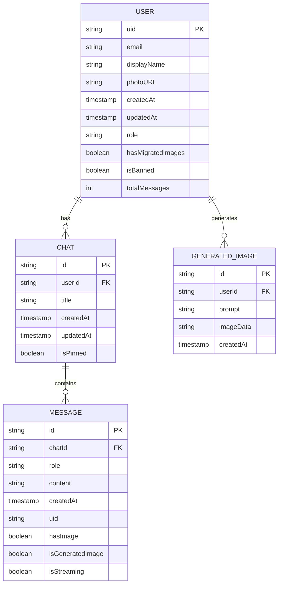
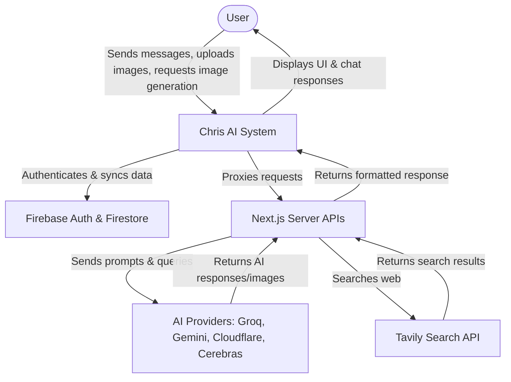
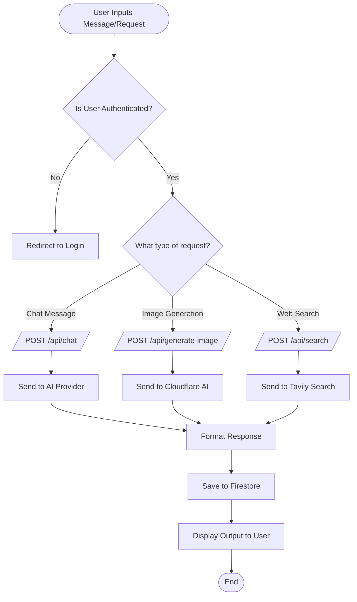

# Chris AI System Documentation

## 1. ENTITY RELATIONSHIP DIAGRAM

## 2. CONTEXT DIAGRAM

## 3. SYSTEM FLOWCHART

## 4. DATABASE DESIGN

**Collection: `users`**
- **`uid`** (Primary Key): String (Required, immutable)
- **`email`**: String (Required, immutable)
- **`displayName`**: String (Optional)
- **`photoURL`**: String (Optional)
- **`createdAt`**: Timestamp (Required, immutable)
- **`updatedAt`**: Timestamp (Optional)
- **`role`**: String (Optional, e.g., 'admin' or 'user')
- **`hasMigratedImages`**: Boolean (Optional)
- **`isBanned`**: Boolean (Optional)
- **`totalMessages`**: Integer (Optional)

**Collection: `chats`** *(Sub-collection of `users`)*
- **`id`** (Primary Key): String (Required, immutable)
- **`userId`** (Foreign Key - implicit via path): String (Required)
- **`title`**: String (Required)
- **`createdAt`**: Timestamp (Required, immutable)
- **`updatedAt`**: Timestamp (Required)
- **`isPinned`**: Boolean (Optional)

**Collection: `messages`** *(Sub-collection of `chats`)*
- **`id`** (Primary Key): String (Required, immutable)
- **`chatId`** (Foreign Key - implicit via path): String (Required)
- **`role`**: String (Required, enum: ['user', 'model'])
- **`content`**: String (Required)
- **`createdAt`**: Timestamp (Required, immutable)
- **`uid`**: String (Optional)
- **`hasImage`**: Boolean (Optional)
- **`isGeneratedImage`**: Boolean (Optional)
- **`isStreaming`**: Boolean (Optional)

**Collection: `generated_images`** *(Sub-collection of `users`)*
- **`id`** (Primary Key): String (Required)
- **`userId`** (Foreign Key - implicit via path): String (Required)
- **`prompt`**: String (Required)
- **`imageData`**: String (Required)
- **`createdAt`**: Timestamp (Required, immutable)

## 5. SYSTEM REQUIREMENTS

**Technical Stack & Frameworks:**
- **Framework:** Next.js (v16.2.1), React (v19.0.0)
- **Language:** TypeScript
- **Styling:** Tailwind CSS (v4.1.14), PostCSS, Styled Components
- **Database & Auth:** Firebase, Firebase Admin SDK
- **UI & Animation:** Lucide React, Motion, Sonner
- **Testing Environment:** Playwright (UI testing), Node Test Runner (`--experimental-strip-types`)
- **Package Manager:** pnpm

**External APIs & Dependencies:**
- Google GenAI API
- Tavily Search API
- Cloudflare AI API
- Groq AI API
- Cerebras AI API
- Nodemailer (for backend email delivery)

**Environment Configurations:**
- **Node.js:** v22+ (required for native TypeScript running with `--experimental-strip-types`)
- **Environment Variables Required:**
  - Firebase Configuration (Client config variables, Admin private keys)
  - API Keys for AI Providers (Gemini, Groq, Cloudflare, Cerebras)
  - Tavily Search API Key
  - Nodemailer SMTP setup (`EMAIL_USER`, `EMAIL_PASSWORD`)

## 6. RECOMMENDATIONS

- **Code Optimization:** For the chat interface, implement virtualization for the message lists to maintain high performance with deeply nested elements as chat histories grow. Consider further memoization of complex Markdown/regex parsing logic to reduce re-rendering strain on the client device.
- **Security Improvements:** Implement rate limiting (e.g., using a tool like Upstash Redis or Cloudflare Workers) on the Next.js `/api/*` endpoints to prevent abuse of unauthenticated API endpoints, quota abuse, and to restrict potential DDoS vectors against the backend LLMs. Rotate OTP JWT secrets periodically and ensure strict adherence to server-side authentication validation rules.
- **Feature Scaling:** Implement database pagination via `startAfter` queries for fetching users' historical chats from Firestore instead of fetching the entire history. This will significantly reduce database read quotas and improve TTFB as users accumulate large volumes of messages.
