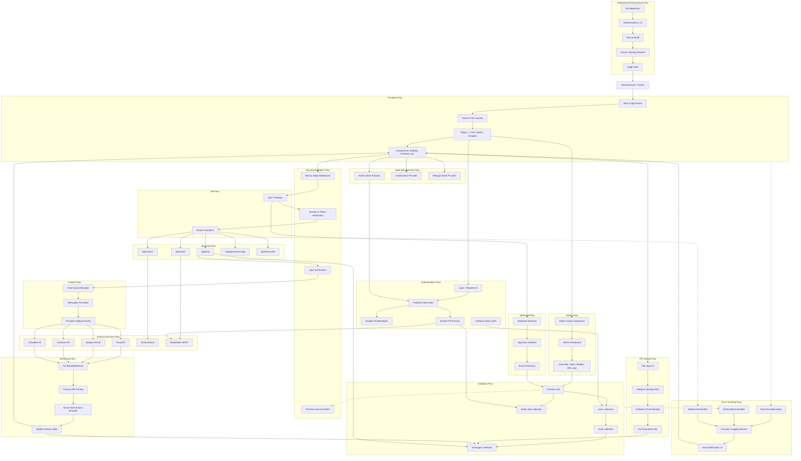

```mermaid
flowchart TD
    %% Deployment/Infrastructure Flow
    subgraph Deployment_Infrastructure_Flow [Deployment/Infrastructure Flow]
        GitRepo["Git Repository"] --> CI_CD["GitHub Actions / CI"]
        CI_CD --> BuildProcess["Next.js Build"]
        BuildProcess --> Hosting["Vercel / Hosting Network"]
        Hosting --> CDN["Edge CDN"]
    end

    UserApp["Client Browser / Device"]
    CDN --> UserApp

    %% Frontend Flow
    subgraph Frontend_Flow [Frontend Flow]
        Router["Next.js App Router"]
        Layout["Root & Chat Layouts"]
        Pages["Pages: /, /chat, /admin, /imagine"]
        UI["Components: Sidebar, ChatArea, etc."]

        Router --> Layout
        Layout --> Pages
        Pages --> UI
    end
    UserApp --> Router

    %% State Management Flow
    subgraph State_Management_Flow [State Management Flow]
        AuthCtx["AuthContext Provider"]
        ChatCtx["ChatContext Provider"]
        DebugCtx["DebugContext Provider"]
    end
    UI --> AuthCtx
    UI --> ChatCtx
    UI --> DebugCtx

    %% Security/Validation Flow
    subgraph Security_Validation_Flow [Security/Validation Flow]
        Middleware["Next.js Edge Middleware"]
        SessionCheck["Session & Token Verification"]
        InputValidation["Input Sanitization"]
        FBRules["Firestore Security Rules"]
    end

    %% Authentication Flow
    subgraph Authentication_Flow [Authentication Flow]
        AuthUI["Login / Register UI"]
        ClientAuth["Firebase Client Auth"]
        GoogleAuth["Google ProviderSignIn"]
        OTPAuth["Email OTP Process"]
        AdminAuth["Firebase Admin Auth"]

        AuthUI --> ClientAuth
        ClientAuth --> GoogleAuth
        ClientAuth --> OTPAuth
    end
    Pages --> AuthUI
    AuthCtx --> ClientAuth

    %% API Flow
    subgraph API_Flow [API Flow]
        API_Gateway["/api/* Gateway"]
        Controllers["Route Controllers"]
    end
    UI --> Middleware
    Middleware --> API_Gateway
    API_Gateway --> SessionCheck
    SessionCheck --> Controllers

    %% Backend Flow
    subgraph Backend_Flow [Backend Flow]
        AuthAPI["/api/auth/*"]
        ChatAPI["/api/chat"]
        SearchAPI["/api/search"]
        ImageAPI["/api/generate-image"]
        TranscribeAPI["/api/transcribe"]
    end
    Controllers --> AuthAPI
    Controllers --> ChatAPI
    Controllers --> SearchAPI
    Controllers --> ImageAPI
    Controllers --> TranscribeAPI

    %% Chat/AI Flow
    subgraph Chat_AI_Flow [Chat/AI Flow]
        Queue["Chat Queue Manager"]
        Fallback["Provider Fallback Router"]
        Format["Messages Formatter"]
    end
    ChatAPI --> InputValidation
    InputValidation --> Queue
    Queue --> Format
    Format --> Fallback

    %% External Services Flow
    subgraph External_Services_Flow [External Services Flow]
        Groq["Groq API"]
        Gemini["Google Gemini"]
        Cerebras["Cerebras API"]
        Cloudflare["Cloudflare AI"]
        Tavily["Tavily Search"]
        SMTP["Nodemailer SMTP"]
    end
    Fallback --> Groq
    Fallback --> Gemini
    Fallback --> Cerebras
    Fallback --> Cloudflare
    SearchAPI --> Tavily
    AuthAPI --> SMTP
    OTPAuth --> SMTP

    %% Streaming Flow
    subgraph Streaming_Flow [Streaming Flow]
        StreamInit["Init ReadableStream"]
        ChunkProcessor["Process API Chunks"]
        SSE["Server-Sent Events Encoder"]
        StreamStore["Update Stream State"]
    end
    Groq --> StreamInit
    Gemini --> StreamInit
    Cerebras --> StreamInit
    Cloudflare --> StreamInit
    StreamInit --> ChunkProcessor
    ChunkProcessor --> SSE
    SSE --> StreamStore
    StreamStore --> UI

    %% Webhook Flow
    subgraph Webhook_Flow [Webhook Flow]
        WebhookEndpoint["Webhook Receiver"]
        SigCheck["Signature Validator"]
        EventProc["Event Processor"]
    end
    API_Gateway --> WebhookEndpoint
    WebhookEndpoint --> SigCheck
    SigCheck --> EventProc

    %% Admin Flow
    subgraph Admin_Flow [Admin Flow]
        AdminGuard["Admin Guard Component"]
        AdminDash["Admin Dashboard"]
        AdminTabs["Overview, Users, Models, DB, Logs"]
    end
    Pages --> AdminGuard
    AdminGuard --> AdminDash
    AdminDash --> AdminTabs

    %% File Upload Flow
    subgraph File_Upload_Flow [File Upload Flow]
        FileUI["File Input UI"]
        FBStorage["Firebase Storage SDK"]
        StorageBucket["Firebase Cloud Storage"]
        GetDL["Get Download URL"]
    end
    UI --> FileUI
    FileUI --> FBStorage
    FBStorage --> StorageBucket
    StorageBucket --> GetDL

    %% Database Flow
    subgraph Database_Flow [Database Flow]
        Firestore["Firestore DB"]
        UsersCol["users collection"]
        ChatsCol["chats collection"]
        MessagesCol["messages collection"]
        OTPCol["email_otps collection"]

        Firestore --> UsersCol
        UsersCol --> ChatsCol
        ChatsCol --> MessagesCol
        Firestore --> OTPCol
        Firestore -.-> FBRules
    end
    GetDL --> MessagesCol
    AdminTabs --> Firestore
    EventProc --> Firestore
    AdminAuth --> UsersCol
    OTPAuth --> OTPCol
    StreamStore --> MessagesCol
    ChatAPI --> MessagesCol

    %% Error Handling Flow
    subgraph Error_Handling_Flow [Error Handling Flow]
        ReactEB["React ErrorBoundary"]
        FBError["FirebaseErrorHandler"]
        GlobalErr["Global errorHandler"]
        Logger["Console / Logging Service"]
        Toast["Toast Notification UI"]

        ReactEB --> Logger
        FBError --> Logger
        GlobalErr --> Logger
        Logger --> Toast
    end
    Frontend_Flow -.-> ReactEB
    API_Flow -.-> GlobalErr
    Database_Flow -.-> FBError
    Toast --> UI
```